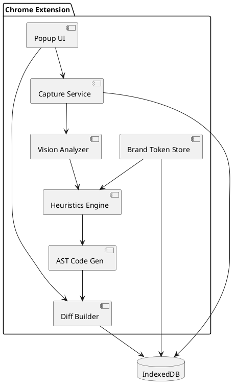

# SPEC‑01‑UX Refactor Assistant

> **Purpose** – A Chrome‑extension‑based assistant that lets a non‑designer engineering team capture existing React screens, detects UI/UX anti‑patterns against Shadcn / Radix heuristics, and generates patch‑ready React + Tailwind code to bring the UI up to brand and accessibility standards—all without leaving the browser.

---

## Background

Engineering teams often “ship it and fix the pixels later,” burdening Product Managers and designers with re‑work tickets and slowing release cadence. Computer‑vision models and AST‑level codemods now make it feasible to automate the drudgery:

* **Input** – one or more screenshots *or* the raw JSX source of a screen.
* **Analysis** – flag issues (contrast, spacing, component misuse) against Shadcn, Radix UI, and WCAG 2.2 AA.
* **Output** – corrected React + Tailwind JSX plus a unified diff a developer can paste into a PR.

The MVP is built to run entirely **client‑side** for privacy and requires no design‑tool familiarity from engineers.

---

## Requirements (MoSCoW)

| Priority   | Requirement                                                                       | Notes                                       |
| ---------- | --------------------------------------------------------------------------------- | ------------------------------------------- |
| **Must**   | Capture 1‑N Chrome tab screenshots **and/or** pasted React JSX                    | Desktop breakpoints 1440×900 & 1920×1080    |
| **Must**   | Detect contrast, spacing, component‑misuse issues using Shadcn + Radix heuristics | WCAG 2.2 AA compliance                      |
| **Must**   | Generate corrected React JSX with Tailwind classes                                | Compiles with `pnpm run dev` out‑of‑the‑box |
| **Must**   | Brand‑token form (colors, fonts, spacing scale) stored locally                    | IndexedDB persistence                       |
| **Should** | Visual before/after diff overlay                                                  | Toggle grid & color‑blind simulators        |
| **Should** | Produce unified diff and copy‑ready patch                                         | GitHub Gist export deferred to v1.1         |
| **Could**  | CLI wrapper for CI pipelines                                                      | Node‑based                                  |
| **Won’t**  | Native mobile or Edge/Firefox support in MVP                                      | Chrome only                                 |

---

## Method

### Architecture Diagram (PlantUML)



### Key Components

| Component             | Tech                                                       | Role                                                                            |
| --------------------- | ---------------------------------------------------------- | ------------------------------------------------------------------------------- |
| **Capture Service**   | `chrome.tabs.captureVisibleTab`, `chrome.debugger`         | Grab PNG + serialized React component tree                                      |
| **Vision Analyzer**   | `@tensorflow/tfjs‑wasm` + UI‑Element‑Detector model (3 MB) | Classify buttons, text, inputs, etc.                                            |
| **Heuristics Engine** | Pure TS rules                                              | Check **contrast**, **spacing**, **component misuse** (v0)                      |
| **AST Code Gen**      | Recast + Babel, Prettier plugin‑tailwindcss                | Apply codemods; replace raw tags with Radix primitives; inject Tailwind classes |
| **Diff Builder**      | `diff` npm pkg                                             | Create unified diff and copy‑to‑clipboard string                                |
| **Brand Token Store** | IndexedDB (idb)                                            | Persist color palette, fonts, spacing steps                                     |

### Data Schemas (TypeScript)

```ts
export interface BrandToken {
  id: string;               // UUID
  primaryHex: string;
  secondaryHex: string;
  accentHex: string[];
  fontFamily: string;
  spacingScale: number[];   // e.g. [2,4,8,16]
}

export interface Finding {
  id: string;
  type: 'contrast'|'spacing'|'component-misuse';
  severity: 'error'|'warn';
  location: DOMRect;
  suggestion: string;
}

export interface ScreenAnalysis {
  id: string;
  timestamp: number;
  imgBlob: Blob;
  jsxSource: string;
  findings: Finding[];
  generatedJsx: string;
  patch: string;            // unified diff
}
```

### Core Algorithms

| Algorithm            | Description                                                                                                   |
| -------------------- | ------------------------------------------------------------------------------------------------------------- |
| **Color‑Contrast**   | Convert RGB → Luminance; use WCAG formula. Suggest closest accessible Radix accent (`--accent-9`).            |
| **Spacing Grid**     | Measure gaps between bounding boxes; round to nearest `spacingScale` value; suggest Tailwind `gap‑*`, `mt‑*`. |
| **Component‑Misuse** | AST walk: raw `<button>` without Radix attributes ⇒ replace with `<Button variant="default">`.                |

### External Libraries / Versions

* `react@18`, `vite@5`, `tailwindcss@3.5`
* `recast@1.8`, `@babel/parser@8`
* `@tensorflow/tfjs‑wasm@4`
* `diff@5`, `idb@8`

---

## Implementation (Solo Builder w/ Cursor AI)

| Phase              | Time\* | Key Activities                                      | Deliverable                  |
| ------------------ | ------ | --------------------------------------------------- | ---------------------------- |
| Prep               | 3 d    | Install **Cursor AI**, learn prompt shortcuts       | Empty repo, CI passes        |
| Extension Skeleton | 6 d    | Cursor snippet: Vite + React + Tailwind Manifest V3 | `v0.0.1` CRX                 |
| Capture Service    | 7 d    | Implement PNG + JSX grab; test on sample site       | `captureService.ts`          |
| Brand Token Form   | 4 d    | Options page CRUD with IndexedDB                    | `brandTokens.json` persisted |
| Vision Analyzer    | 9 d    | Integrate pre‑trained model; benchmark              | `analyzeImage()`             |
| Heuristics Rules   | 6 d    | Three rules + Jest tests via Cursor                 | `Finding[]`                  |
| AST CodeGen & Diff | 8 d    | Codemods w/ Recast; Prettier format; unified diff   | `generatePatch()`            |
| Popup Polish       | 5 d    | Before/After toggle; Lighthouse ≥90                 | MVP UX                       |
| Release            | 4 d    | Manual QA; store listing assets                     | `v0.1.0.crx`                 |

\*Approx. 4 focused hrs/day ⇒ \~6 weeks.

---

## Milestones

| #      | Date (week) | Checkpoint        | Done‑Criteria           |
| ------ | ----------- | ----------------- | ----------------------- |
| **M0** |  0 + 3 d    | Workspace ready   | Editor, repo, CI green  |
| **M1** |  1 end      | Skeleton in store | CRX installs locally    |
| **M2** |  2 mid      | Capture works     | Screenshot + JSX stored |
| **M3** |  3 start    | Brand tokens      | Palette saved/restored  |
| **M4** |  4 start    | Vision Analyzer   | ≥80 % bbox accuracy     |
| **M5** |  4 end      | Heuristics v0     | Jest suite green        |
| **M6** |  5 mid      | Code Gen diff     | Patch displays          |
| **M7** |  5 end      | Polished UX       | Lighthouse ≥90          |
| **M8** |  6 mid      | Internal beta     | End‑to‑end on 3 screens |
| **M9** |  6 + 4 d    | v0.1.0            | CRX packaged & docs     |

---

## Gathering Results

| Goal                    | Metric                       | Measurement                | MVP Target |
| ----------------------- | ---------------------------- | -------------------------- | ---------- |
| Fewer UI‑defect tickets | Jira bugs / sprint           | Compare 2 sprints pre/post | ‑30 %      |
| Dev adoption            | % engineers using patch      | Slack poll each sprint     | ≥ 50 %     |
| Quality uplift          | Lighthouse **Accessibility** | 10 key screens             | ≥ 90/100   |
| Perf overhead           | Capture → diff time          | `performance.now()`        | ≤ 1.5 s    |
| Solo effort vs. plan    | Logged hrs / 115 h           | Simple time log            | ≤ 1.2×     |

**Evaluation cadence**

1. **Baseline sprint** without tool.
2. **Pilot sprints** (post‑M8).
3. **Review** metrics → decide roadmap (e.g., multi‑screen flow, Gist export).